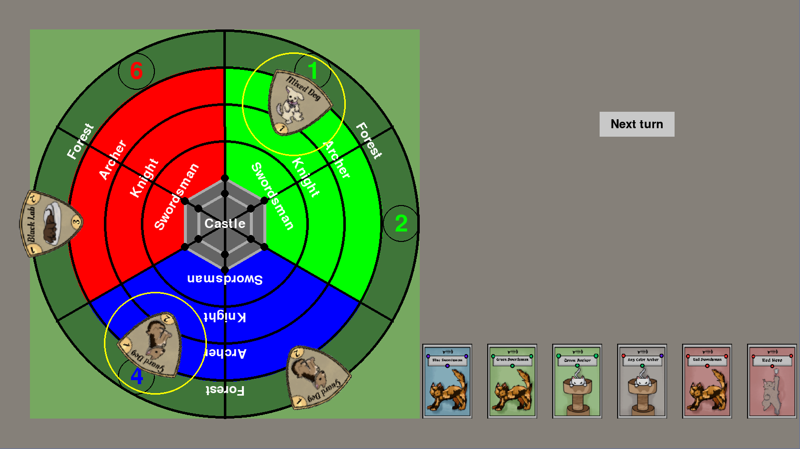

# CatStle Panic 
An animal themed recreation of [Castle Panic](https://firesidegames.com/product/castle-panic-second-edition/) 
## Getting Started

### Prerequisites

Ensure you have the following installed:

```
Python 3.x
pygame
make (optional, for running the project with Makefile)
```

To install pygame, run:

```
pip install pygame
```

### Installing

1. Clone the repository:

```
git clone https://github.com/cafox2003/CatSle_Panic.git
cd CatSle_Panic
```

2. Run the game:

```
make run  # or manually python main.py from src/
```

## Built With

* [Python](https://www.python.org/) - Programming language
* [pygame](https://www.pygame.org/) - Used for rendering of graphics

## Contributing

Contributions are welcome! If you find a bug, have a feature request, or would like to contribute code, feel free to open an issue or submit a pull request.
## License
This project is licensed under the MIT License - see the [LICENSE.md](LICENSE.md) file for details.
## Acknowledgments
* Inspired by *Castle Panic* board game
* My wonderful girlfriend - for creating the all the artwork
